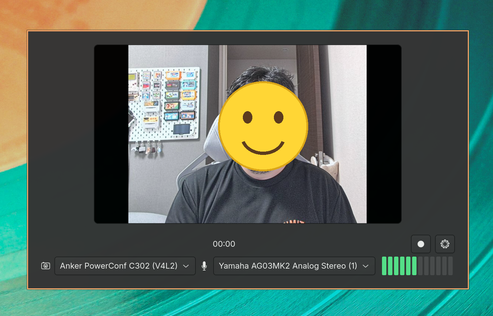

# mugvideo

Mugvideo is a small C + GTK4 desktop app for quickly recording selfie videos and pasting them into chat apps.



Record a short video, stop recording, then paste it directly into Discord, Slack, or another app that accepts files from the clipboard. Mugvideo saves the recording as an MP4 file and puts the saved video file itself on the clipboard.

The compact GTK4 window includes a live camera preview, camera and microphone selectors, a microphone input meter, and simple record/settings controls.

## Install

### Arch Linux

Mugvideo is available from the AUR:

```sh
yay -S mugvideo-git
```

### Debian / Ubuntu / Fedora / openSUSE

Install from source with one command:

```sh
curl -fsSL https://raw.githubusercontent.com/komagata/mugvideo/main/install.sh | sh
```

The script installs build dependencies, builds Mugvideo, and installs it to `/usr/local`.
To install somewhere else:

```sh
curl -fsSL https://raw.githubusercontent.com/komagata/mugvideo/main/install.sh | PREFIX="$HOME/.local" sh
```

## Notes

The install commands above install the required GTK4 and GStreamer packages for you.

## Development

For development or manual builds, install GTK4, GStreamer, and the GStreamer plugins for camera input, MP4 output, and audio encoding.

```sh
pkg-config --exists gtk4
pkg-config --exists gstreamer-1.0
pkg-config --exists gstreamer-app-1.0
make
./mugvideo
```

The current C version provides a GTK4 UI, GStreamer camera preview, device selection, recording state UI, microphone level meter, settings persistence, MP4 recording, and clipboard copy of the saved video file.

## Settings

Settings are stored in `~/.config/mugvideo/settings.ini`. The default output directory is `~/Videos/mugvideo`.
